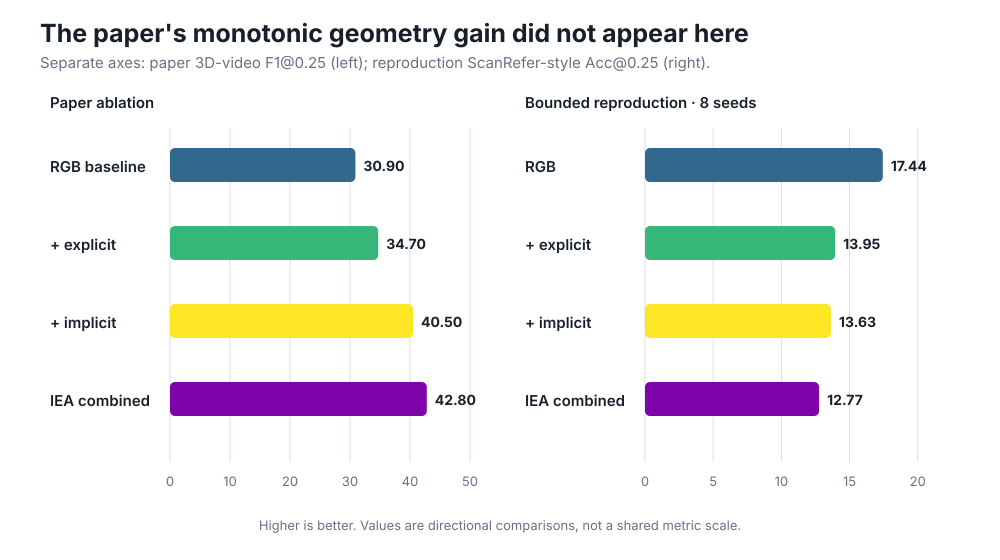
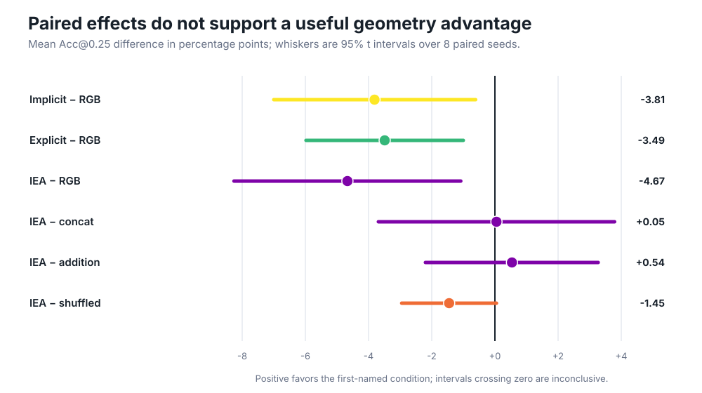
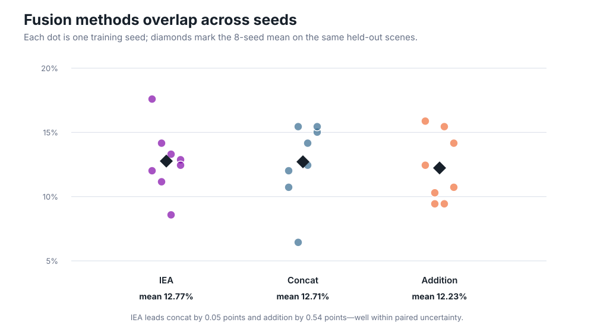
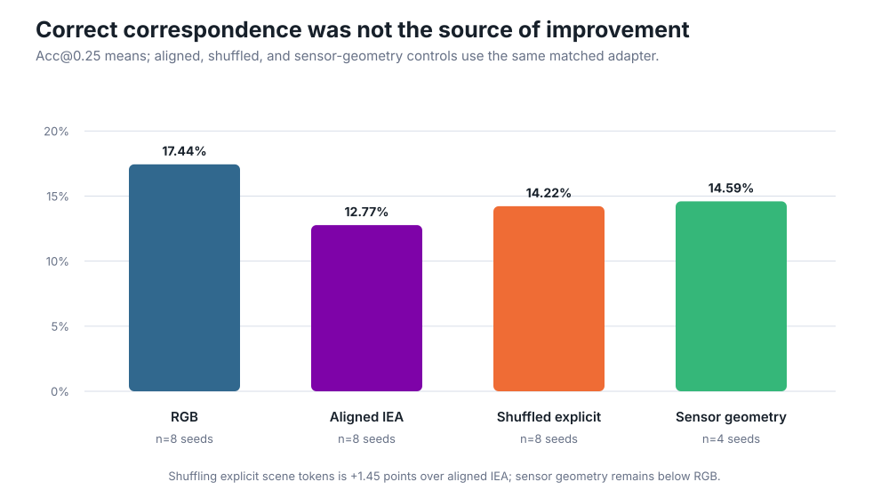

# When Does Geometry Help a Vision–Language Model?

Vision–language models can name what appears in an image yet still struggle to locate objects in three dimensions. The paper *3D-Aware VLMs with Implicit and Explicit Geometries* proposes two complementary aids: learned summaries of scene shape and explicit reconstructed 3D points. This reproduction asks whether either aid beats ordinary image features, and whether cross-attention combines them better than simple fusion.

## Verdict

**Not reproduced in this bounded setup.** On a public ten-scene ScanNet/ScanRefer-style split, RGB-only reached **17.44% Acc@0.25**, while implicit geometry reached **13.63%**, reconstructed explicit geometry **13.95%**, and combined cross-attention **12.77%**. This is a proposal-refined frozen-encoder adapter test—not the paper’s 3B multi-task VLM—so the result is evidence about this regime, not a refutation of the full paper.

**How to read this figure.** The left panel is the paper’s 3D-video F1@0.25 ablation; the right is our held-out grounding Acc@0.25. Their scales are intentionally separate. The paper reports a monotonic improvement as geometry is added; the reproduction shows the opposite ordering.

  
[Interactive tutorial notebook](https://molab.marimo.io/github/alphaXiv/3d-aware-vlms-with-implicit-and-explicit-geometr/blob/main/notebooks/geometry_reproduction.py) · [Measured results](results.json)

## What was tested

We used six public scenes for training, four disjoint scenes for testing, eight RGB frames per scene, 328 training annotations, and 233 held-out referring expressions. Each example selected among the scene’s real object boxes; accuracy records whether the selected box overlaps the target at 0.25 or 0.50 intersection-over-union.

CLIP supplied frozen image and text features. Frozen VGGT supplied (1) learned scene tokens and (2) point maps reconstructed from RGB; its use is a documented substitute for the paper’s unavailable AnySplat training recipe. Every condition registered exactly **595,073 trainable parameters**, saw identical data, and used seeds 0–7. The [encoder path](../../src/reproduce.py#L264-L362) and [matched fusion adapter](../../src/reproduce.py#L414-L470) are compact enough to audit.

The queue runner verified **18 successful Kubernetes runs** on **NVIDIA RTX PRO 6000 Blackwell GPUs**, with **16 GPUs peak concurrent**, four per job. The observed Kubernetes campaign took **1.955439 wall hours** (about 1 h 57 min 20 s). Individual four-seed jobs took 20.4–25.2 minutes.

| Condition | Feature scenes/s | Train examples/s | Inference examples/s |
|---|---:|---:|---:|
| RGB | 0.60 | 17.40 | 354.50 |
| Implicit | 0.72 | 19.73 | 592.23 |
| Explicit | 0.89 | 18.22 | 1,220.38 |
| IEA | 0.54 | 17.61 | 424.59 |

Rates average the two four-seed jobs per headline condition. Inference batches are small, so throughput is descriptive rather than a ranking claim.

## Claim-by-claim evidence

| Claim | Paper result | Observed result | Assessment |
|---|---:|---:|---|
| Implicit geometry improves on RGB | 40.5 vs 30.9 F1@0.25 | −3.81 points, 95% CI [−7.00, −0.61] | Divergent in this setup |
| Explicit geometry improves on RGB | 34.7 vs 30.9 F1@0.25 | −3.49 points, 95% CI [−5.98, −1.00] | Divergent in this setup |
| Combined IEA beats simple fusion | 42.8 vs 41.5 concat / 42.4 add | +0.05 vs concat; +0.54 vs add | Inconclusive; intervals span zero |
| Correct geometry is mechanistically useful | Combined is best in the paper ablation | IEA −1.45 vs shuffled, CI [−2.95, +0.05] | Not supported here |

The first three rows each use eight paired seeds per condition; the four-seed sensor control used another 22.9-minute job. All measurements came from successful terminal Kubernetes logs created after the recovery cutoff.

Paired intervals make the key distinction clear: the single-source geometry deficits exclude zero, while the tiny fusion differences do not. IEA was also 0.86 points below implicit-only and 1.18 below explicit-only.

## Fusion and correspondence diagnostics

IEA, concatenation, and addition overlap heavily across seeds. Cross-attention’s eight-seed mean is numerically highest among them, but a 0.05-point lead over concatenation is not persuasive evidence of the paper’s claimed advantage—and every fusion method trails RGB.

Shuffling explicit tokens between scenes improved on aligned IEA by 1.45 points. Replacing reconstructed points with privileged sensor-mesh points raised IEA to 14.59%, but still left it 2.85 points below the eight-seed RGB mean. Together these controls do not support correct geometric correspondence as the beneficial mechanism in this adapter.

## Interpretation and limitations

The likely boundary is representation and training scale. The paper jointly trains a 3B VLM with geometry projectors on broader tasks; this reproduction freezes CLIP and VGGT and trains a small proposal scorer on a local split of public validation scenes. It evaluates grounded selection among known boxes, not free-form detection, and its official-paper metric is therefore not directly comparable in magnitude.

Still, the experiment is a meaningful stress test: real public RGB-D scenes, reconstructed rather than sensor depth as primary evidence, held-out scenes, matched capacity, paired seeds, simple-fusion controls, and a shuffled-geometry negative control. A full reproduction would require the authors’ exact AnySplat checkpoints/data preparation, official ScanRefer train/validation assets, and their 3B multi-task training recipe. Under the tested substitution, neither target claim showed the reported practical benefit.

## Reproduce or inspect

The exact experiment command was `bash scripts/run_reproduction.sh`; Kubernetes cloned each linked branch tip and ran that same command. Start with the [RGB branch](https://github.com/alphaXiv/3d-aware-vlms-with-implicit-and-explicit-geometr/tree/orx/verified-ten-scene-rgb), [implicit branch](https://github.com/alphaXiv/3d-aware-vlms-with-implicit-and-explicit-geometr/tree/orx/verified-implicit-augmentation), [explicit branch](https://github.com/alphaXiv/3d-aware-vlms-with-implicit-and-explicit-geometr/tree/orx/verified-explicit-reconstruction), [IEA branch](https://github.com/alphaXiv/3d-aware-vlms-with-implicit-and-explicit-geometr/tree/orx/verified-combined-iea), and [shuffled control](https://github.com/alphaXiv/3d-aware-vlms-with-implicit-and-explicit-geometr/tree/orx/verified-shuffled-explicit-control).
